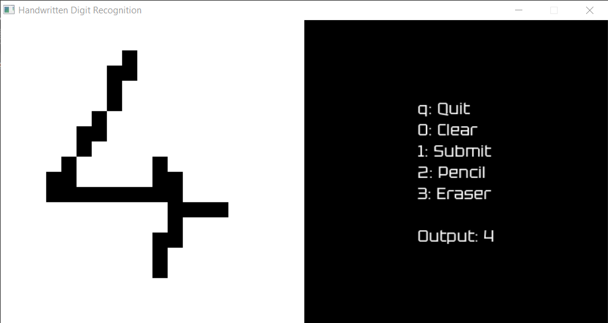
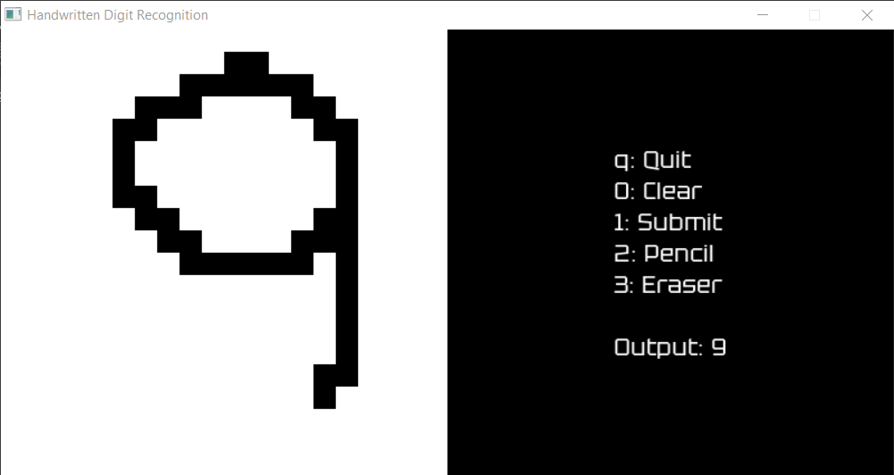

# Neural network for handwritten digit recognition
A simple neural network made in C that is able to recognize handwritten digits

## Features
- Train the neural network on MNIST dataset
- Load previously saved training
- Test the neural network on MNIST dataset
- Test the neural network on your own digits 

## Draw your own digits



## Neural network structure
- Input layer: 784 neurons
- Hidden layer: 50 neurons
- Output layer: 10 neurons
- Activation function: Sigmoid

## Preprocessing 
- 4px padding on every side of the image (applied only for digits drawn using the GUI)
- color normalization
- TODO: preprocess the drawn images so that they are more similar to those of the MNIST dataset

## Accuracy (using weights and biases saved in conf.txt)
- 95.53% on MNIST dataset test inputs (on a total of 10000 images)
- 96.61% on MNIST dataset training inputs (on a total of 60000 images)
- with other digits the accuracy is lower since the images are very different

## Requirements  
- SDL
- SDL ttf
- make (optional)

## SDL Installation
If you are on Windows, you can use the preinstalled SDL version in SDL folder (it's the 64-bit version). If you are on Linux you can run this command to install SDL
```
sudo apt-get install libsdl2-dev libsdl2-ttf-dev
```

## MNIST Dataset
- Extract the archive MNIST_Dataset/MNIST_Dataset.rar (the dataset was over 100MB so I had to compress it)

## Build
You can find two makefiles in makefiles folder. Move the one corresponding to your OS in the main folder and run 
```
make
```  
If you don't have make, run the command corresponding to your OS:  
#### Windows
```
gcc -I SDL/include -I include -L SDL/lib -o bin/main main.c src/global.c src/gui.c src/nn.c src/utilities.c -l mingw32 -l SDL2main -l SDL2 -l SDL2_ttf
```
#### Linux
```
gcc -I include -o bin/main main.c src/global.c src/gui.c src/nn.c src/utilities.c -l mingw32 -l SDL2main -l SDL2 -l SDL2_ttf

```

## Execute
To run the executable file run 
```
bin/main
```
